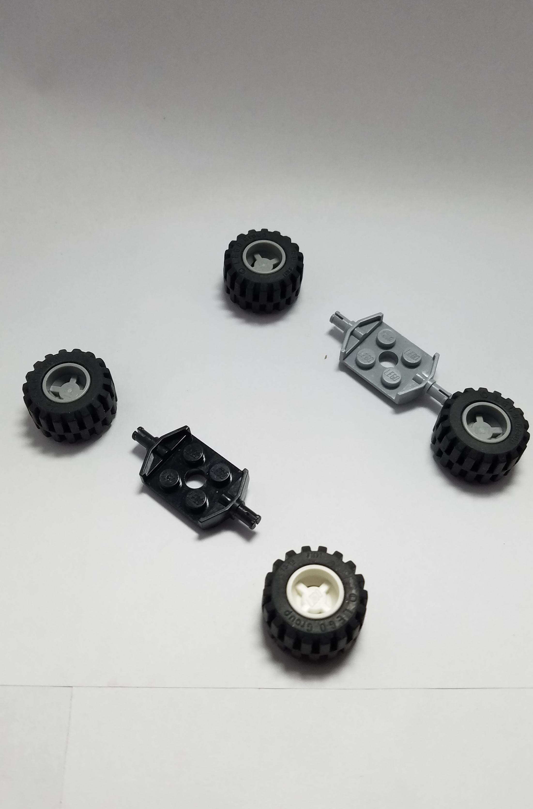
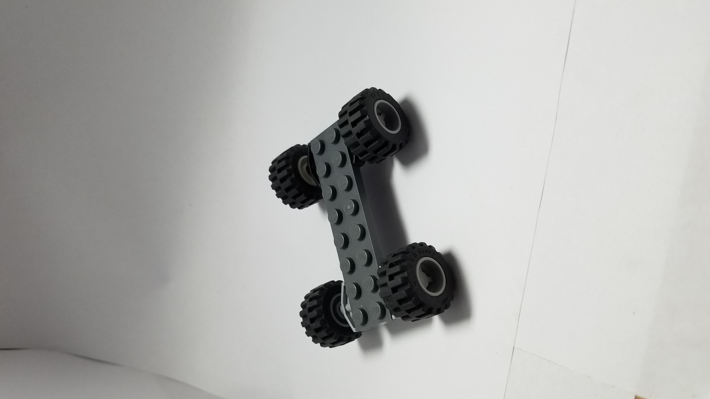
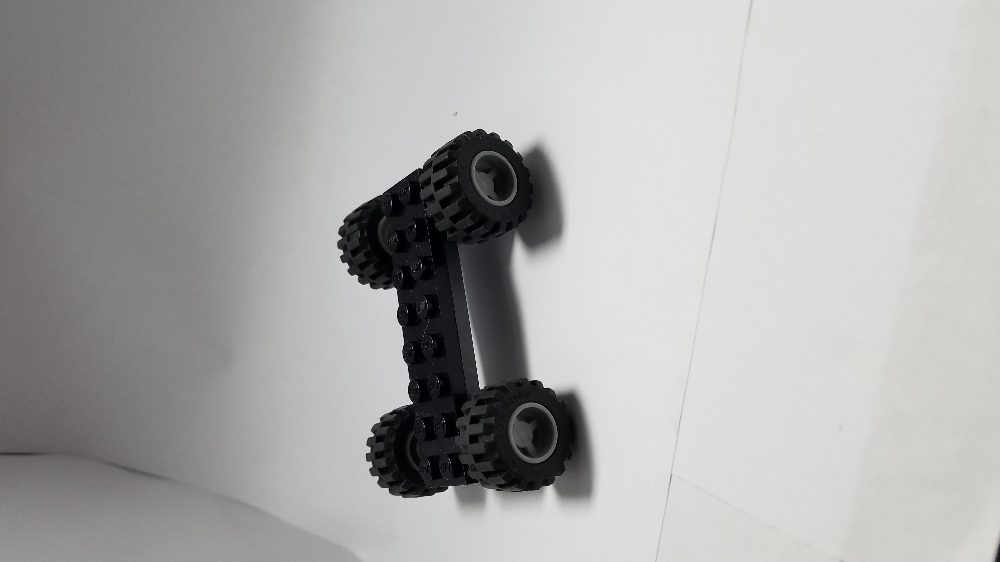
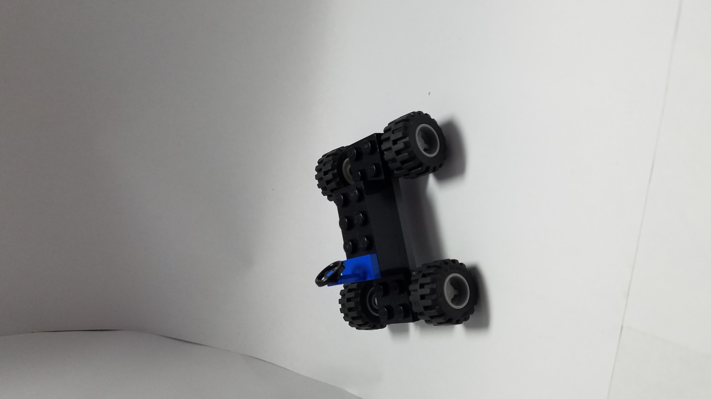
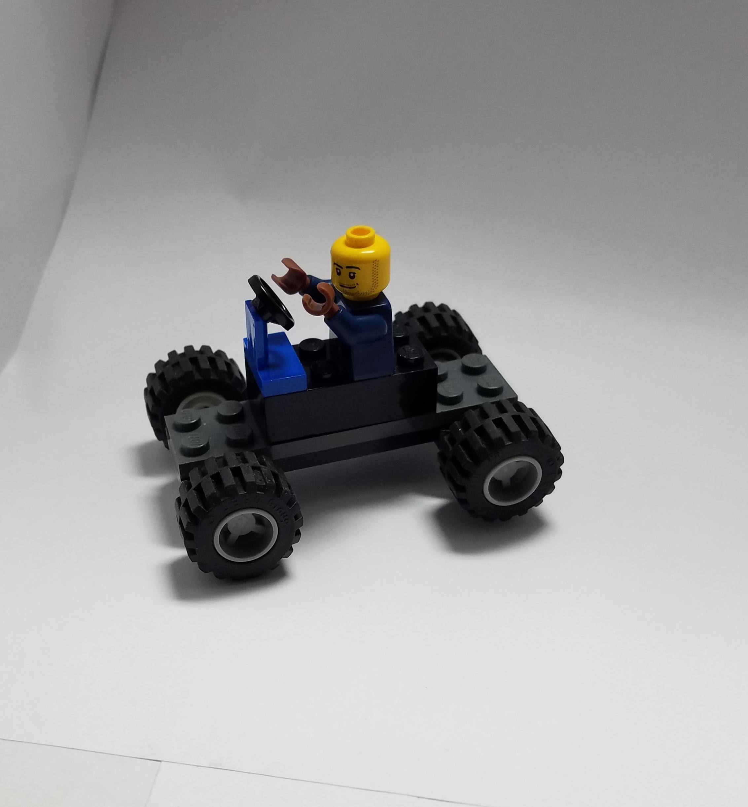

# How to construct man driving utlity vehicle

**STEP 1**

-Take grey axcel and attach wheel to either side
-Repete with black axcel

**STEP 2**

-Take wheel assemblies and attach to either end of black eight section piece.

**STEP 3**

-Take black eight section piece and attach grey eight section piece directly to top.

**STEP 4**

-Attach four section segment to top in center.

**STEP 5**

-Place steering wheel on the first section of black four segment piece.

**STEP 6**

-Last place driver one section back from steering wheel.

